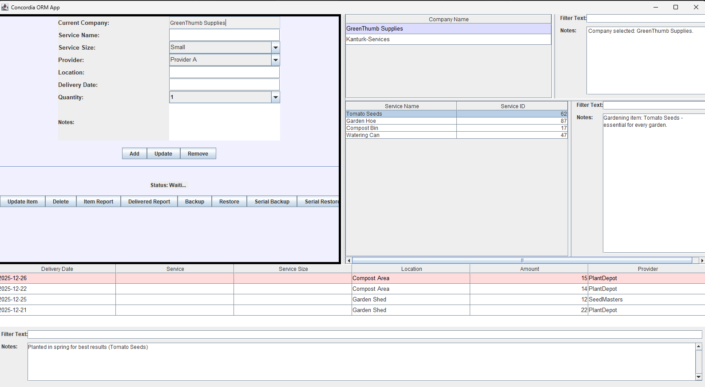

# Data Warehouse

## Java Swing Warehouse Management Application

**Data Warehouse** is a Java Swing warehouse management application originally developed as part of the **Higher Diploma in Cloud and Mobile Applications with Data Science in 2015**.

This repository contains an updated and repaired version of the application, including bug fixes to the original Warehouse Java Swing application.

The project is being preserved as part of a collection of earlier academic software projects, while also being brought back to a state where it can be built and run locally.

---

## Application Screenshot

<!--
Add a screenshot here once the application is running successfully.

Example:


-->



---

## Project Overview

The application is a desktop-based warehouse management system developed using Java Swing.

The system models a warehouse environment in which companies, products and stock can be managed through a graphical user interface.

The application uses Java object-oriented programming and persistent data to maintain warehouse information.

The current repository represents an updated version of the original coursework application, with subsequent bug fixes and changes made to allow the older application to be recovered and run again.

---

## Main Features

The application provides functionality for managing warehouse data, including areas such as:

* Company management
* Product and stock management
* Warehouse operations
* Data entry through a graphical user interface
* Searching and viewing stored information
* Updating warehouse records
* Persistent application data
* Database connectivity
* Java Swing desktop interfaces

The exact functionality reflects the original 2015 coursework implementation and the subsequent bug fixes made to the application.

---

## Application Structure

The main source code is located in:

```text
src/WareHouse
```

The project follows a traditional Java desktop application structure.

```text
                         Data Warehouse
                               |
                               v
                         MainDriver
                               |
                               v
                        Java Swing UI
                               |
                 +-------------+-------------+
                 |                           |
                 v                           v
          Warehouse Classes            Database Layer
                 |                           |
                 +-------------+-------------+
                               |
                               v
                          Data Storage
```

---

## Main Entry Point

The application is launched through:

```text
WareHouse.MainDriver
```

`MainDriver` provides the main entry point for starting the Java Swing application.

The compiled classes are placed in:

```text
bin
```

and the Java source is located under:

```text
src/WareHouse
```

---

## Project Files

The repository contains the following important components:

```text
DataWareHouse/
│
├── src/
│   └── WareHouse/
│       └── Java source files
│
├── bin/
│   └── Compiled Java classes
│
├── lib/
│   └── External Java libraries
│
├── Company11.ser
│
├── .classpath
├── .project
│
├── Readme.text.docx
├── Report-JavaProject.txt
├── datebaseWarehouse--toreuse.txt
│
├── db-check.ps1
└── run.ps1
```

The repository retains several files from the original development environment, including Eclipse project metadata, serialized data and database notes.

---

## Technologies

The project was developed using:

* **Java**
* **Java Swing**
* **MySQL**
* **JDBC**
* **Object-oriented programming**
* **Eclipse-era Java project structure**

The project uses the MySQL JDBC connector to communicate with the database.

The original project was configured for an older Java environment, while the updated repository has subsequently been worked on using more recent Java tooling.

---

## Database

The application uses a database to persist warehouse information.

Database-related material is retained in the repository, including:

```text
datebaseWarehouse--toreuse.txt
```

and the database checking script:

```text
db-check.ps1
```

The database layer provides the connection between the Java Swing application and the persistent warehouse data.

---

## Persistent Data

The repository also contains:

```text
Company11.ser
```

This is a serialized Java data file from the application.

Its presence reflects the original application's use of Java object serialization for persistent application data.

---

## Running the Application

The application can be run from the command line once the required Java version and MySQL JDBC library are available.

The main class is:

```text
WareHouse.MainDriver
```

For example:

```powershell
java -cp "bin;lib\mysql-connector-java-5.1.34-bin.jar" WareHouse.MainDriver
```

The repository also contains:

```text
run.ps1
```

which is intended to assist with running the application.

### Important

The original project contained an absolute Windows path to the MySQL JDBC driver in its Eclipse `.classpath` file.

That path referred to the original development machine and therefore needs to be replaced with a project-relative path when running the application on another computer.

For example:

```xml
<classpathentry
    kind="lib"
    path="lib/mysql-connector-java-5.1.34-bin.jar"/>
```

This makes the project portable within the repository.

---

## Historical Development

The original Warehouse application was developed as coursework in **2015** as part of the:

**Higher Diploma in Cloud and Mobile Applications with Data Science**

The application represents the technologies, development practices and Java desktop programming techniques used during that period.

The original project used a traditional Java Swing desktop architecture rather than a web-based application.

---

## Updated Version

This repository is not simply a copy of the original coursework.

It contains subsequent **bug fixes and updates to the 2014/2015-era Warehouse Java Swing application**, with the aim of recovering the application and making it usable again on a modern development machine.

The repository currently contains source code, compiled classes, libraries, database material and scripts associated with this recovery work.

The original project structure has largely been retained so that the relationship between the coursework version and the updated version remains clear.

---

## Legacy Considerations

This is a historical academic Java application rather than a modern enterprise warehouse management system.

The code reflects the technology and practices of its original development period, including:

* Java Swing desktop UI
* Eclipse project metadata
* Older Java conventions
* JDBC database access
* Java serialization
* Older MySQL JDBC drivers
* Direct database configuration
* Legacy project structure

Some of these components require adjustment when running the application on a modern computer.

The intention of the updated repository is to **restore and document the original application**, while making the minimum necessary changes to get it running again.

---

## Project Status

**Historical / Educational Project — Updated**

Original coursework:

**Higher Diploma in Cloud and Mobile Applications with Data Science — 2015**

Current repository:

**Updated Java Swing Warehouse Application with bug fixes and local-run support**

The next milestone is to successfully run the application locally and capture a screenshot of the working interface for the project documentation.

---

## Repository

The project is available on GitHub:

[DataWareHouse](https://github.com/pio-o-connell/DataWareHouse)

---

## Author / Coursework

Developed as part of the:

**Higher Diploma in Cloud and Mobile Applications with Data Science**

**2015**

Project: **Data Warehouse — Java Swing Warehouse Management Application**
